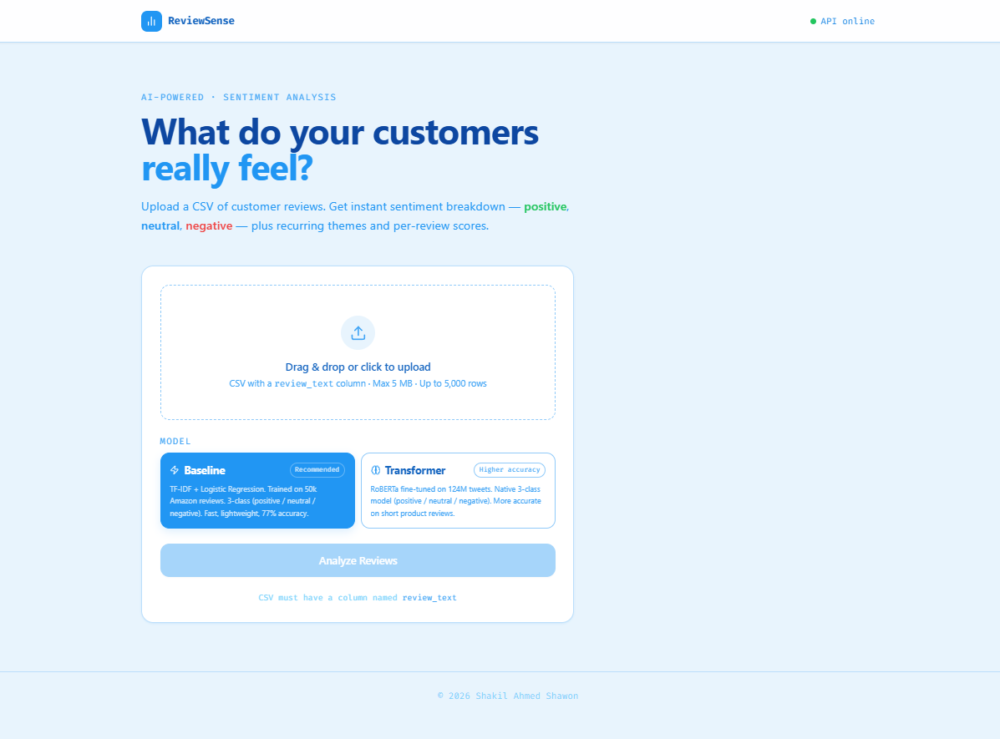
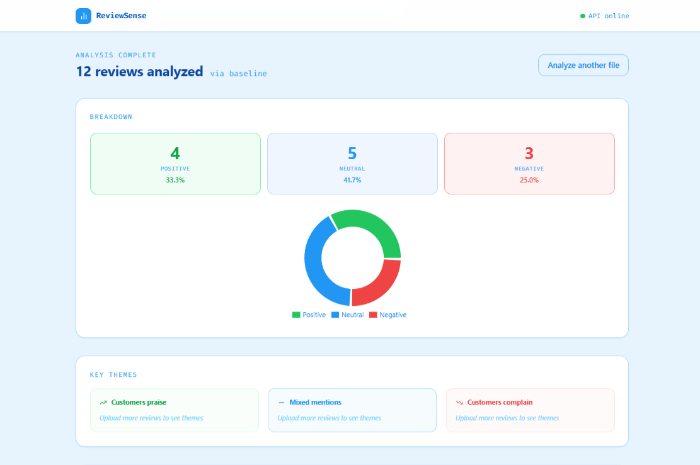
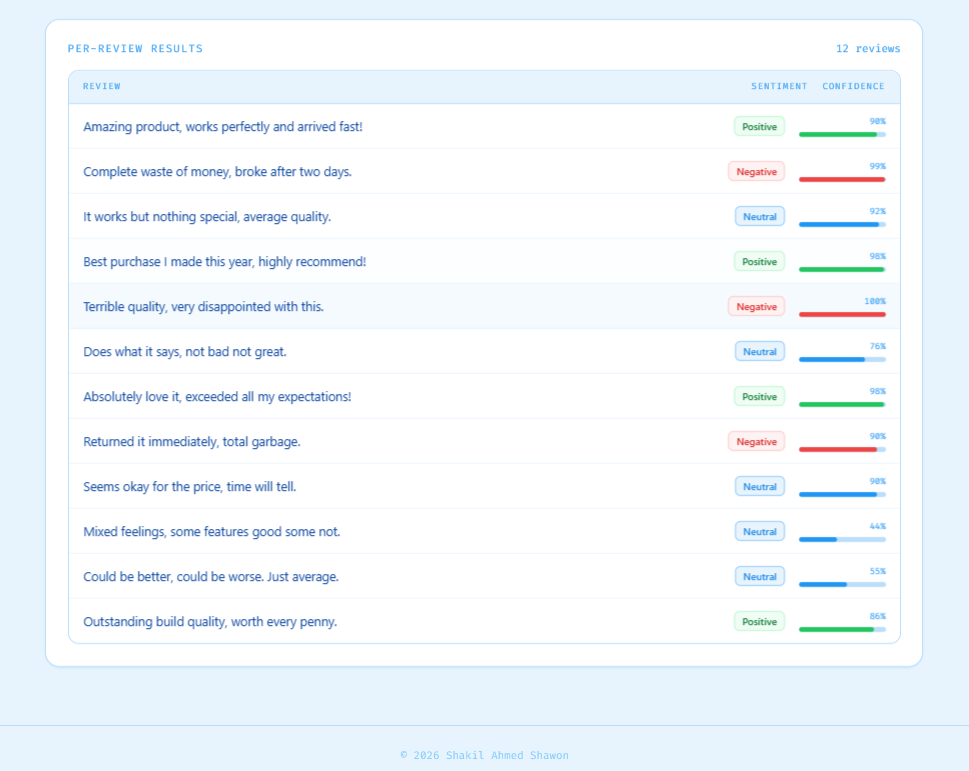
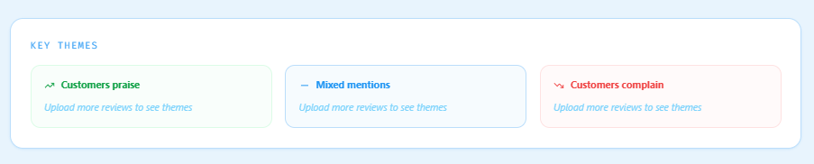
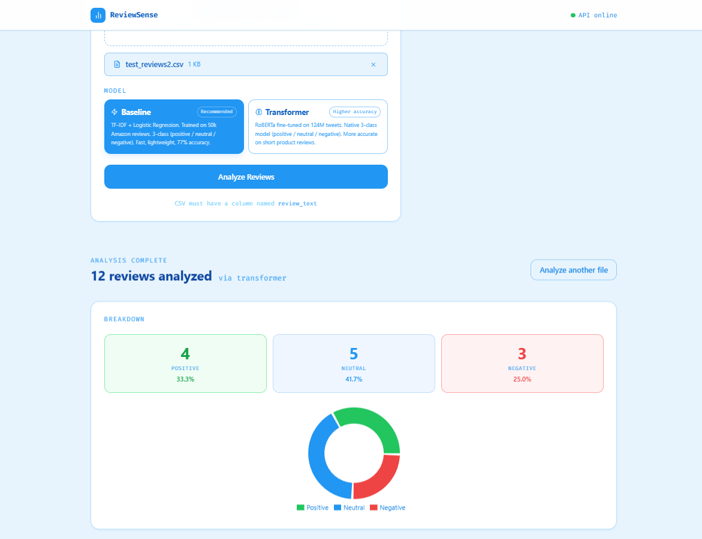
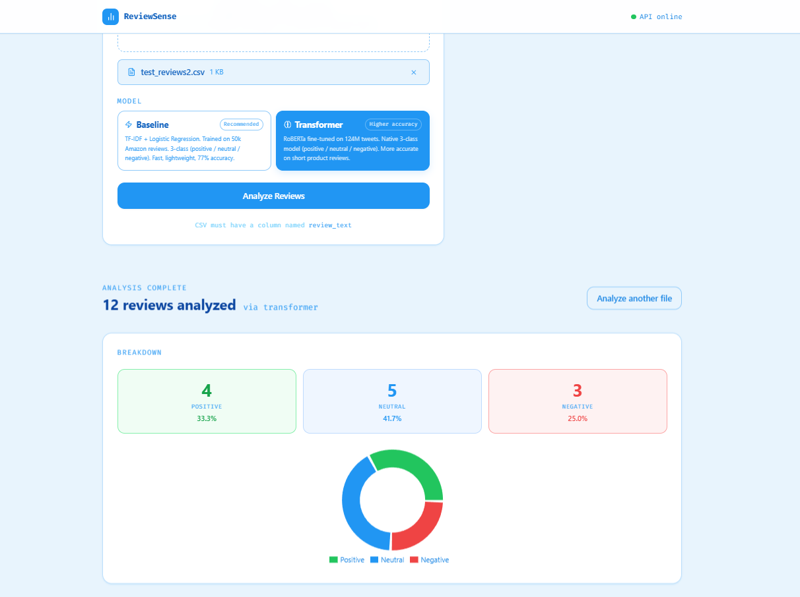

# ReviewSense 🚀

**ReviewSense** is an AI-powered customer review management platform and dashboard. It allows businesses to track, analyze, and respond to customer feedback across multiple online platforms (such as Google, Facebook, and Trustpilot) from a single centralized interface.

## ✨ Key Features

* **Multi-Platform Aggregation:** Consolidates reviews from major platforms into one unified feed.
* **Sentiment Analysis Pipeline:** Classifies customer sentiment and automatically flags toxic, spam, or negative reviews using custom machine learning algorithms.
* **AI-Powered Response Generator:** Automatically drafts context-aware, personalized, and on-brand replies to user reviews in over 50 languages.
* **Multi-Location Support:** Designed to handle review tracking for franchises or agencies managing multiple physical storefronts simultaneously.

## 📸 App Showcase

| | |
|:---|:---|
|  <br> **Seamless Data Upload** — Drag and drop a CSV of customer reviews. The UI automatically validates columns before analysis. |  <br> **Sentiment Breakdown** — Get a clear, visual overview of overall customer sentiment (Positive, Neutral, Negative) via interactive charts. |
|  <br> **Granular Review Analysis** — Dive into individual reviews with AI-generated sentiment tags and precise model confidence scores. |  <br> **Key Theme Extraction** — Automatically group feedback into distinct themes to identify what customers praise or complain about most. |
|  <br> **Baseline Model** — Utilize a fast, lightweight TF-IDF & Logistic Regression pipeline for rapid sentiment classification. |  <br> **Transformer Model** — Switch to a high-accuracy RoBERTa model fine-tuned on 124M tweets for nuanced text classification. |

## 🛠️ Tech Stack

* **Frontend:** JavaScript, HTML/CSS
* **Backend:** Python
* **Machine Learning & NLP:** TF-IDF, Logistic Regression, Naive Bayes, LinearSVC
* **Data Processing:** Handled datasets exceeding 500MB (including the Amazon Fine Food Reviews dataset) for training and evaluation.

## 🚀 Getting Started

### Prerequisites
* Python 3.8+
* Node.js & npm 

### Installation & Setup

**1. Clone the repository:**
```bash
git clone [https://github.com/Shakil-ahmed-shawonn/reviewsense.git](https://github.com/Shakil-ahmed-shawonn/reviewsense.git)
cd reviewsense

# Navigate to the backend directory
cd backend

# Create and activate a virtual environment
python -m venv venv
source venv/bin/activate  # On Windows use: venv\Scripts\activate

# Install dependencies (ensure you have a requirements.txt file)
pip install -r requirements.txt

# Navigate to the frontend directory
cd ../frontend

# Install dependencies and run
npm install
npm start
```
## 📊 Note on Data & Model Training

Due to GitHub's file size limits, the raw datasets used to train the sentiment analysis models (e.g., `amazon-fine-food-reviews.zip`, `Reviews.csv`, `database.sqlite`) are **not** included in this repository. 

To run the training scripts locally, ensure you place your dataset files inside the `training/` directory. These files are explicitly ignored by Git to keep the repository lightweight.

## 📄 License
This project is open-source and available under the [MIT License](LICENSE).
